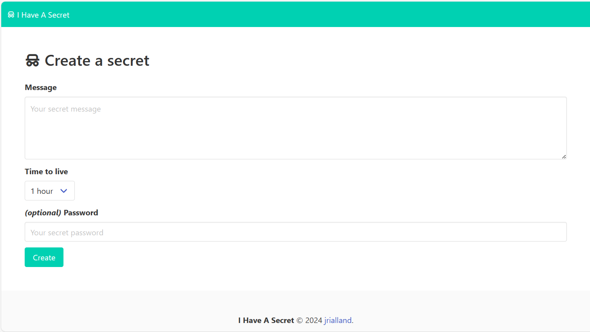
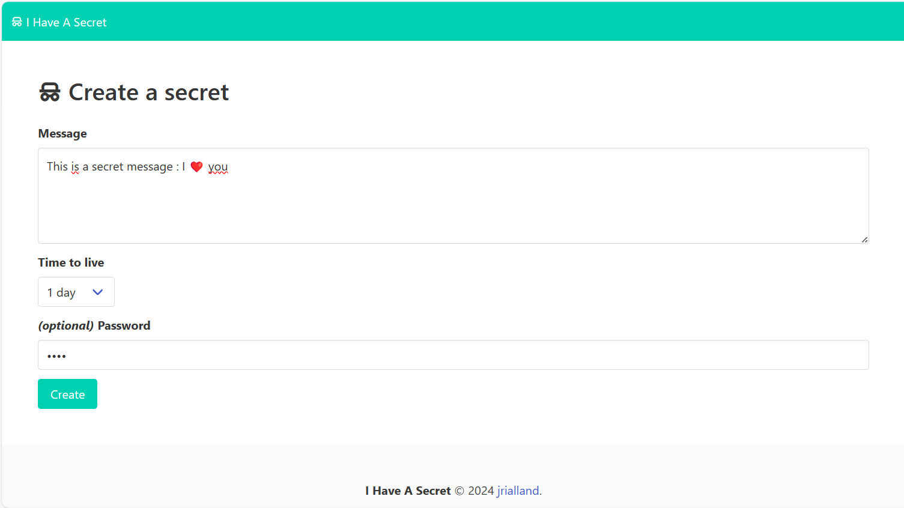
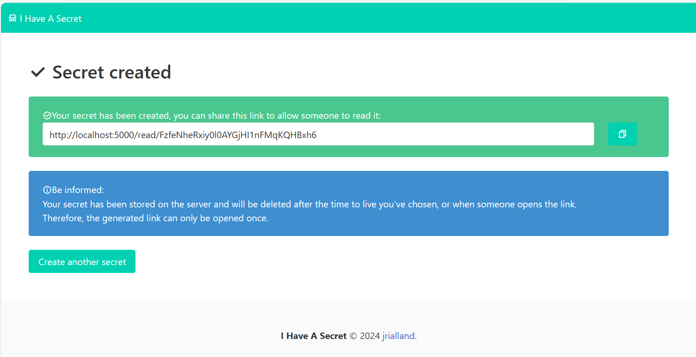
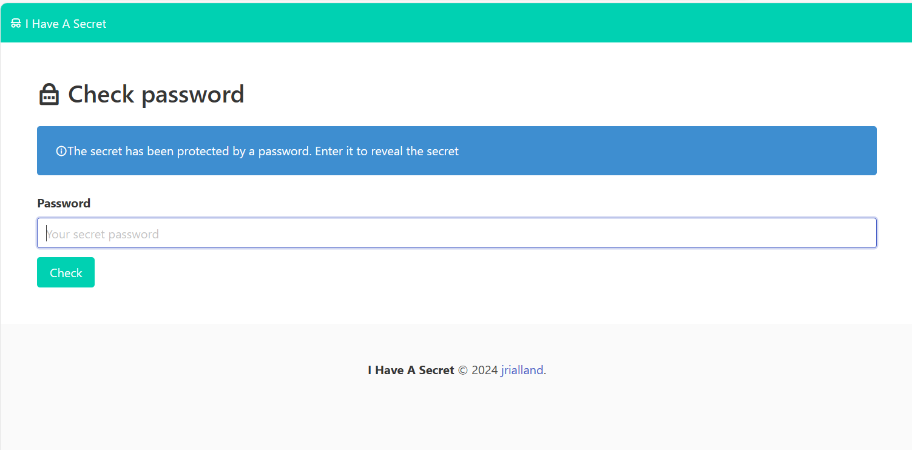
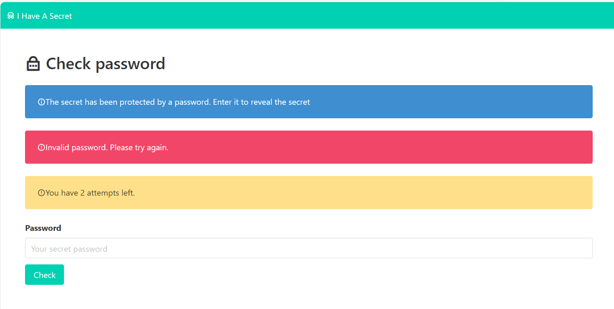

ihaveasecret
============

A straightforward web application that enables users to share confidential information with others via temporary links. Once the recipient opens the link, the secret message is automatically removed from the server.

Secrets are stored in Redis and encrypted using the application's secret key.

The application is intentionally designed to be as simple as possible to meet stringent security standards: minimal JavaScript, basic CSS, and no extravagant features.

It employs the following components:
 * [python](https://www.python.org/) 3.12
 * [flask](https://flask.palletsprojects.com/en/3.0.x/) ( and [waitress](https://github.com/Pylons/waitress) )
 * [pycryptodome](https://www.pycryptodome.org/)
 * [redis-py](https://github.com/redis/redis-py)
 * [bulma](https://bulma.io/)
 * [remixicon](https://remixicon.com/)

Configuration
-----

Configuration can be accomplished by utilizing Docker secrets, environment variables, or a configuration file. The resolution of configuration settings follows this sequence:

1. Check for a file named the same as the setting in the directory /run/secrets. If such a file exists, the value is extracted from the file's content.
2. Verify if an environment variable with the corresponding name exists.
3. Search for the key in the configuration file named "config.json".

The following table provides guidance on configuring the app:

| key | secret file | environment variable | definition | default value |
|---|---|---|---|---|
|app.secret_key|/run/secrets/app.secret_key|APP_SECRET_KEY|used for as flask unique key| none (mandatory)|
|app.url_prefix|/run/secrets/app.url_prefix|APP_URL_PREFIX|path to prepend to all uris| empty|
|app.proxy_fix|/run/secrets/app.proxy_fix|APP_PROXY_FIX|if set to True, handle X-Forwarded-For header|False|
|secrets.max_length|/run/secrets/secrets.max_length|SECRETS_MAX_LENGTH|maximum allowed messages length|2048|
|redis.url|/run/secrets/redis.url|REDIS_URL|redis url|none, in-memory storage is used if missing|
|passwords.max_attempts|/run/secrets/password.max_attempts|PASSWORDS_MAX_ATTEMPTS|how many tries are allowed|3|
|app.disable_email|/run/secrets/app.disable_email|APP_DISABLE_EMAIL|disable email notifications|false|
|smtp.sender_email|/run/secrets/smtp.sender_email|SMTP_SENDER_EMAIL|sender address|noreply@ihaveasecret.io|
|smtp.server|/run/secrets/smtp.server|SMTP_SERVER|smtp host|localhost|
|smtp_port|/run/secrets/smtp.port|SMTP_PORT|smtp port|587|
|smtp_user|/run/secrets/smtp.user|SMTP_USER|smtp user|(none)|
|smtp_password|/run/secrets/smtp.password|smtp password|(none)|

TODOs :
-------
 * <strike>Translations</strike>
 * <strike>Document configuration keys</strike>
 * <strike>javascript : hint on password strength (https://github.com/dropbox/zxcvbn ?)</strike>
 * <strike>javascript : message length</strike>

Development :
-----------
I use [podman-compose](https://github.com/containers/podman-compose) :

```
podman-compose up -d
```
Will start the application in debug (=flask auto-reload) mode along with a redis instance.

production :
------------

using docker or podman : `docker build -t ihaveasecret -f Containerfile`

i18n
-----
`pybabel extract -F babel.cfg -o messages.pot .`
`pybabel init -i messages.pot -d translations -l fr`
`pybabel compile -d translations`
`pybabel update -i messages.pot -d translations`

Screenshots :
-------------






